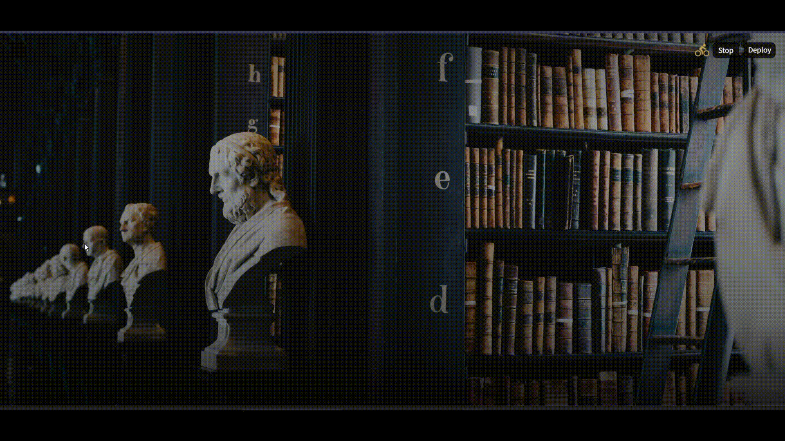

<div align="center">
  <h1>🏛️ LIBRARIAN</h1>
  <p><i>Consult your local librarian.</i></p>
  
</div>


[English](#english) | [Türkçe](#türkçe)

<a id="ingilizce"></a>
## English

**Librarian** is a fully offline, AI-powered book recommendation and search assistant. Built using Microsoft Foundry Local, it combines a local embedding model, a local chat model, and a curated book dataset in a Retrieval-Augmented Generation (RAG) pipeline with zero internet connection or cloud API requirements.

Developed as part of the Microsoft AI Innovators Summer Internship program.

### Models Used

| Role | Model | Provider / Engine |
| :--- | :--- | :--- |
| **Embedding Model** | `qwen3-embedding-0.6b` | Microsoft Foundry Local |
| **Chat LLM** | `qwen2.5-1.5b` *(OpenVINO-GPU)* | Microsoft Foundry Local |

### Key Features

* **Two Search Modes:** Book recommendations based on genre/theme/mood OR specific book summary lookups.
* **Smart Retrieval:** 19 `broad_genre` categories with fuzzy matching for typos and exact-title boosting.
* **Session Context:** Remembers active genres and discussed books for seamless follow-ups.
* **Hallucination Mitigation:** Grounded refusals for out-of-scope books, prompt-leak prevention, and repetition truncation for small local models.
* **Persistent Reading Log:** Track your read books directly in a local SQLite database via the Streamlit UI.

### File Structure & Core Components
├── data/books.xlsx                                    # Source book dataset
├── ingest.py                                          # Processes Excel data & stores embeddings in SQLite
├── rag_engine.py                                      # Core RAG pipeline (search, genre filter, generation)
├── foundry_utils.py                                   # Lightweight CLI wrapper for Microsoft Foundry Local
├── reading_list.py                                    # SQLite manager for the persistent reading log
├── app.py                                             # Themed Streamlit user interface
├── assets/
│   ├── demo.gif
│   └── giammarco-boscaro-zeH-ljawHtg-unsplash.jpg     # UI background picture
├── requirements.txt                                   # Project dependencies

### Quick Start

```bash
# 1. Install dependencies
pip install -r requirements.txt

# 2. Build database and embeddings
python ingest.py

# 3. Launch the app
streamlit run app.py
```

---

### Acknowledgments & Credits

* **Background Photo:** Photo by [Giammarco Boscaro](https://unsplash.com/@giammarco) on [Unsplash](https://unsplash.com/).

<a id="türkçe"></a>
## Türkçe

**Librarian**, Microsoft Foundry Local altyapısını kullanarak tamamen çevrimdışı çalışan, yapay zeka destekli bir kitap tavsiye ve bilgi asistanıdır. Yerel vektör (embedding) ve sohbet (chat) modellerini bir RAG mimarisinde birleştirerek internete ihtiyaç duymadan cihaz üzerinde çalışır.

**Microsoft AI Innovators Yaz Stajı** projesi olarak geliştirilmiştir.

### Kullanılan Modeller

| Görev | Model | Sağlayıcı / Motor |
| :--- | :--- | :--- |
| **Vektör (Embedding) Modeli** | `qwen3-embedding-0.6b` | Microsoft Foundry Local |
| **Sohbet (Chat) Modeli** | `qwen2.5-1.5b` *(OpenVINO-GPU)* | Microsoft Foundry Local |

### Öne Çıkan Özellikler

* **Çift Modlu Çalışma:** Tür/tema bazlı kitap önerileri veya belirli bir kitabın spoilersız özeti.
* **Gelişmiş Vektör Araması:** 19 ana tür kategorisi, yazım hatalarına toleranslı bulanık eşleşme (*"bulum kurgu"* → *"Bilim Kurgu"*) ve kesin başlık önceliği.
* **Bağlam Takibi:** Konuşma sırasında son bahsedilen kitabı ve türü hatırlar (*"yazarı kim?"* gibi takip eden sorular için).
* **Halüsinasyon Engelleme:** Kütüphanede olmayan kitaplar için net ret yanıtları, `<think>` etiketi temizliği ve küçük modeller için döngü engelleme.
* **Kalıcı Okuma Listesi:** Okuduğunuz kitapları Streamlit arayüzünden tek tıkla yerel SQLite veritabanına kaydetme.

### Dosya Yapısı ve Bileşenler

* `ingest.py`: Excel'deki verileri okur, yerel embedding modelinden geçirip SQLite veritabanına (`assistant.db`) kaydeder.
* `rag_engine.py`: Vektör araması, tür filtreleme ve LLM yanıtı oluşturma süreçlerini yöneten ana RAG motoru.
* `foundry_utils.py`: Microsoft Foundry Local CLI'sı ile doğrudan haberleşen hafif yardımcı katman.
* `reading_list.py`: Kullanıcının okuma listesini veritabanında saklayan ve yöneten modül.
* `app.py`: "Eski kütüphane" temalı Streamlit kullanıcı arayüzü.

### Nasıl çalıştırılır?

```bash
# 1. Gerekli tool'ları yükleyin
pip install -r requirements.txt

# 2. Veritabanını ve embedding'leri oluşturun
python ingest.py

# 3. Uygulamayı başlatın
streamlit run app.py
```
---

### 📸 Teşekkür & Telif Bilgisi

* **Arka Plan Görseli:** [Unsplash](https://unsplash.com/) [Giammarco Boscaro](https://unsplash.com/@giammarco) 
